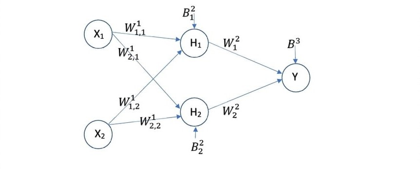
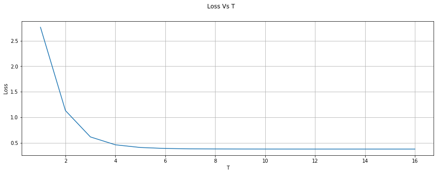

# Two-layer-XOR
A simple neural network which will learn the XOR logic gate.

If for some reason github cannot render equations properly "Equations are exceptionally small, and often malformed and misplaced on the page" then you can simply copy-paste the URL of the "XOR Back Propagation.ipynb" file into https://nbviewer.jupyter.org/ website which should render it properly.

### Model Arictecture :

### Training 

